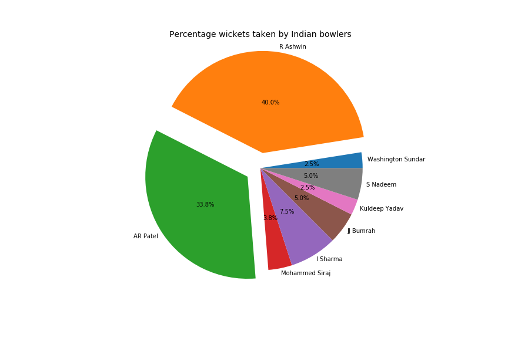

# Exploratory Data Analysis of England tour of India Feb-March 2021   
  As a Hardcore cricket fan and a Data enthusiast, I absolutely loved every second i spent on this project. The project involves collection of data from the web to make a csv file and then visualize it.

data scaraped from- 'https://www.espncricinfo.com/ci/engine/series/1243364.html?view=records'

### Tools used-
1) MySql - To scrape data, make tables and join tables based on my need
2) Pandas and NumPy packages- To analyse and understand the data
3) Matplotlib and Seaborn packages - To visualize the collected table

# Files- 
1)analysis.sql - data scraping and creating csv
2)Cricket_EDA.ipynb - eda and data visualization using python
3)batting.csv,bowling.csv,combined.csv- csv files that was scraped
4)wicketspercent.png - image file for visualization

Conclusion-

